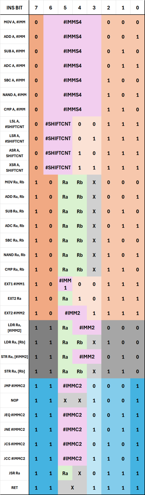

# ttcpu ISA

This file outlines the exact (custom) instruction set architecture defined for the ttcpu, as well as how to assemble code for the ttcpu.

## Design Philosophy

The goal of ttcpu was to create a computationally-sufficient RISC CPU architecture. We define computationally-sufficient as having enough instructions such that general programmatic concepts (such as if/else, while, for statements) can all be implemented in a meaningful way, allowing general-purpose computer programs to be loaded and executed.

The RISC architecture requires more information to be defined in the instruction than CISC, with all instructions taking exactly 1 clock cycle to occur. Hence the 8-bit instruction word has been designed around being able to load full 4-bit immeditate values without any sign-extending of smaller inputs.

## Design Overview

### Accumulator Registers

The ttcpu contains two main 'accumulator' registers, named `A` and `B`, both 4-bit registers. All instructions can occur on register `A`, whereas operations concerning immediate values or shifts can only occur on register `A` (due to instruction word size constraints).

### Program Counters

The ttcpu also contains two 6-bit registers, `PC` and `PCX`. `PC` (program counter) stores the address of the instruction currently being executed, and can be modified through the use of jump instructions (along with extend instructions). `PCX` (subroutine program counter) allows native non-nested subroutines to be implemented, allowing for the ttcpu to return to the base program after a subroutine is complete automatically upon a RET (return) instruction.

### Flags

The ttcpu has two flags:

- `FlagZ` (zero flag)
- `FlagC` (carry flag)

FlagZ is written to by all ALU instructions, as well as memory load instructions. The value of FlagZ is 1 only if the data value is exactly equal to 0. FlagZ has an associated jump instruction JEQ/JNE.

FlagC is written to by all ALU instructions except MOV and NAND. The value of FlagC is 1 if the full adder/subtracter in the ALU has a MSB carry-out or, in the case of shifts, the value of the bit last shifted out. FlagC has an associated jump instruction JCS/JCC.

## Instruction Set Architecture

The ISA is defined in the image below:

> **Key:** `X` = don't care (ideally set to zero), `#IMM` = immediate value, `Ra`/`Rb` = register select

### Immediate Values

There are five types of immediate value that can be inputted into various instructions. Note that they vary in binary representation, and their individual syntaxes are outlined below:

- `#IMMS4`: 4-bit signed (two's complement) -> domain [-16, 15]
- `#SHIFTCNT`: 2-bit unsigned -> domain [0, 3]
- `#IMM2`: 2-bit unsigned -> domain [0, 3]
- `#IMM1`: 1-bit unsigned -> domain [0, 1]
- `#IMMC2`: 2-bit with correcting offset -> domain {-3, -2, 2, 3}

### Individual Instruction Definitions

This section outlines the syntax and detailed function of each ttcpu instruction from the perspective of an assembly-language programmer, simplifying some of the machine-code-level nuances.

| Instruction Opcode | Operation | Writes to Register? | Writes to Flags? |
| --- | --- | --- | --- |
| `MOV` | `A := #IMMS4`; `Ra := Rb`| `A` for immediate; `Ra` | `Z` |
| `ADD` | `A := A + #IMMS4`; `Ra := Ra + Rb`| `A` for immediate; `Ra` | `Z`, `C` |
| `SUB` | `A := A - #IMMS4`; `Ra := Ra - Rb`| `A` for immediate; `Ra` | `Z`, `C` |

| `ADC` | `A := A - #IMMS4`; `Ra := Ra - Rb + FlagC`| `A` for immediate; `Ra` | `Z`, `C` |
| `SBC` | `A := A - #IMMS4`; `Ra := Ra - Rb + (FlagC - 1)`| `A` for immediate; `Ra` | `Z`, `C` |
| `NAND` | `A := A - #IMMS4`; `Ra := ~(Ra && Rb)`| `A` for immediate; `Ra` | `Z` |
| `CMP` | `A := A - #IMMS4`; `Ra - Rb`| \- | `Z`, `C` |

## Assembling ttcpu Programs